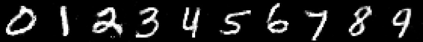

## PyTorch GANs :computer: vs :computer: = :heart:
This repo contains PyTorch implementation of various GAN architectures. <br/>
It's aimed at making it **easy for beginners** to start playing and learning about GANs.

## Table of Contents
  * [What are GANs?](#what-are-gans)
  * [Setup](#setup)
  * [Implementations](#implementations)
    + [Vanilla GAN](#vanilla-gan)
    + [Conditional GAN](#conditional-gan)
    + [DCGAN](#dcgan)

## What are GANs?

GANs were originally proposed by Ian Goodfellow et al. in a seminal paper called [Generative Adversarial Nets](https://papers.nips.cc/paper/5423-generative-adversarial-nets.pdf).

GANs are a framework where 2 models (usually neural networks), called generator (G) and discriminator (D), play a **minimax game** against each other.
The generator is trying to **learn the distribution of real data** and is the network which we're usually interested in.
During the game the goal of the generator is to trick the discriminator into "thinking" that the data it generates is real.
The goal of the discriminator, on the other hand, is to correctly discriminate between the generated (fake) images and real images coming from some dataset (e.g. MNIST).

## Setup

1. `git clone https://github.com/gordicaleksa/pytorch-gans`
2. Open Anaconda console and navigate into project directory `cd path_to_repo`
3. Run `conda env create` from project directory (this will create a brand new conda environment).
4. Run `activate pytorch-gans` (for running scripts from your console or set the interpreter in your IDE)

That's it! It should work out-of-the-box executing environment.yml file which deals with dependencies.

-----

PyTorch package will pull some version of CUDA with it, but it is highly recommended that you install system-wide CUDA beforehand, mostly because of GPU drivers. I also recommend using Miniconda installer as a way to get conda on your system. 

Follow through points 1 and 2 of [this setup](https://github.com/Petlja/PSIML/blob/master/docs/MachineSetup.md) and use the most up-to-date versions of Miniconda and CUDA/cuDNN.

## Implementations

## Vanilla GAN

Vanilla GAN is my implementation of the [original GAN paper (Goodfellow et al.)](https://papers.nips.cc/paper/5423-generative-adversarial-nets.pdf) with certain modifications mostly in the model architecture,
like the usage of LeakyReLU and 1D batch normalization (it didn't even exist back then) instead of maxout activation and dropout.

### Examples

Network was trained on data from MNIST dataset. Here are a couple of samples from the dataset:

You can see how the network is slowly learning to capture the data distribution during training:

After the generator is trained we can use it to generate all 10 digits:

<p align="center">

</p>

We can also pick 2 numbers we like like (i.e. their latent vectors) and linearly or spherically interpolated between them:

### Basic Usage (train and interpolation)

*Note: also make sure to check out playground.py file if you're having problems understanding adversarial loss.*

### Experimenting

## Conditional GAN

## DCGAN

## Acknowledgements

I found these repos useful (while developing this one):
* [gans](https://github.com/diegoalejogm/gans) (PyTorch & TensorFlow)
* [PyTorch-GAN](https://github.com/eriklindernoren/PyTorch-GAN) (PyTorch)

## Citation

If you find this code useful for your research, please cite the following:

```
@misc{Gordić2020PyTorchGANs,
  author = {Gordić, Aleksa},
  title = {pytorch-gans},
  year = {2020},
  publisher = {GitHub},
  journal = {GitHub repository},
  howpublished = {\url{https://github.com/gordicaleksa/pytorch-gans}},
}
```

## Licence

[](https://github.com/gordicaleksa/pytorch-gans/blob/master/LICENCE)