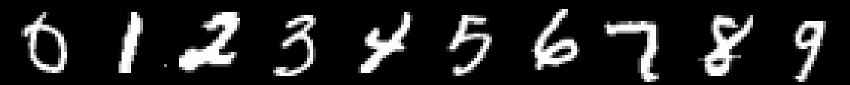
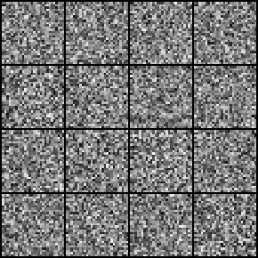
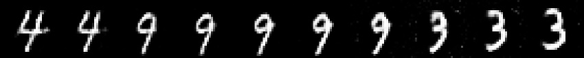
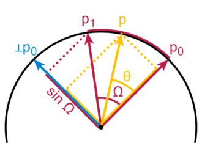
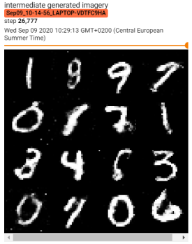
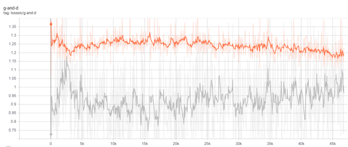
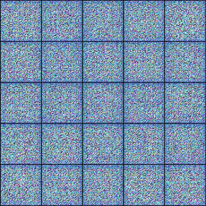
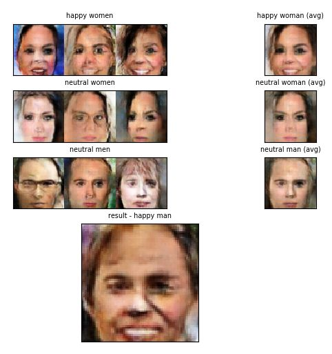

## PyTorch GANs :computer: vs :computer: = :heart:
This repo contains PyTorch implementation of various GAN architectures. <br/>
It's aimed at making it **easy for beginners** to start playing and learning about GANs. <br/>

All of the repos I found do obscure things like setting bias in some network layer to `False` without explaining <br/>
why certain design decisions were made. This repo makes **every design decision transparent.**

## Table of Contents
  * [What are GANs?](#what-are-gans)
  * [Setup](#setup)
  * [Implementations](#implementations)
    + [Vanilla GAN](#vanilla-gan)
    + [Conditional GAN](#conditional-gan)
    + [DCGAN](#dcgan)

## What are GANs?

GANs were originally proposed by Ian Goodfellow et al. in a seminal paper called [Generative Adversarial Nets](https://papers.nips.cc/paper/5423-generative-adversarial-nets.pdf).

GANs are a framework where 2 models (usually neural networks), called generator (G) and discriminator (D), play a **minimax game** against each other.
The generator is trying to **learn the distribution of real data** and is the network which we're usually interested in.
During the game the goal of the generator is to trick the discriminator into "thinking" that the data it generates is real.
The goal of the discriminator, on the other hand, is to correctly discriminate between the generated (fake) images and real images coming from some dataset (e.g. MNIST).

## Setup

1. `git clone https://github.com/gordicaleksa/pytorch-gans`
2. Open Anaconda console and navigate into project directory `cd path_to_repo`
3. Run `conda env create` from project directory (this will create a brand new conda environment).
4. Run `activate pytorch-gans` (for running scripts from your console or set the interpreter in your IDE)

That's it! It should work out-of-the-box executing environment.yml file which deals with dependencies.

-----

PyTorch package will pull some version of CUDA with it, but it is highly recommended that you install system-wide CUDA beforehand, mostly because of GPU drivers. I also recommend using Miniconda installer as a way to get conda on your system. 

Follow through points 1 and 2 of [this setup](https://github.com/Petlja/PSIML/blob/master/docs/MachineSetup.md) and use the most up-to-date versions of Miniconda and CUDA/cuDNN.

## Implementations

Important note: you don't need to train the GANs to use this project I've checked-in pre-trained models. <br/>
You can just use the `generate_imagery.py` script to play with the models.

## Vanilla GAN

Vanilla GAN is my implementation of the [original GAN paper (Goodfellow et al.)](https://papers.nips.cc/paper/5423-generative-adversarial-nets.pdf) with certain modifications mostly in the model architecture,
like the usage of LeakyReLU and 1D batch normalization (it didn't even exist back then) instead of the maxout activation and dropout.

### Examples

GAN was trained on data from MNIST dataset. Here is how the digits from the dataset look like:

<p align="center">

</p>

You can see how the network is slowly learning to capture the data distribution during training:

<p align="center">

</p>

After the generator is trained we can use it to generate all 10 digits! Looks like it's coming directly from MNIST, right!?

<p align="center">

</p>

We can also pick 2 generated numbers that we like, save their latent vectors, and subsequently [linearly](https://en.wikipedia.org/wiki/Linear_interpolation) or [spherically](https://en.wikipedia.org/wiki/Slerp)<br/>
interpolate between them to generate new images and understand how the latent space (z-space) is structured:

<p align="center">

</p>

We can see how the number 4 is slowly morphing into 9 and then into the number 3. <br/>

The idea behind spherical interpolation is super easy - instead of moving over the shortest possible path<br/>
(line i.e. linear interpolation) from the first vector (p0) to the second (p1), you take the sphere's arc path: 

<p align="center">

</p>

### Usage

#### Option 1: Jupyter Notebook

Just run `jupyter notebook` from you Anaconda console and it will open the session in your default browser. <br/>
Open `Vanilla GAN (PyTorch).py` and you're ready to play! <br/>

If you created the env before I added jupyter just do `pip install jupyter==1.0.0` and you're ready.

---

**Note:** if you get `DLL load failed while importing win32api: The specified module could not be found` <br/>
Just do `pip uninstall pywin32` and then either `pip install pywin32` or `conda install pywin32` [should fix it](https://github.com/jupyter/notebook/issues/4980)!

#### Option 2: Use your IDE of choice

#### Training

It's really easy to kick-off new training just run this: <br/>
`python train_vanilla_gan.py --batch_size <number which won't break your GPU's VRAM>`

The code is well commented so you can exactly understand how the training itself works. <br/>

The script will:
* Dump checkpoint *.pth models into `models/checkpoints/`
* Dump the final *.pth model into `models/binaries/`
* Dump intermediate generated imagery into `data/debug_imagery/`
* Download MNIST (~100 MB) the first time you run it and place it into `data/MNIST/`
* Dump tensorboard data into `runs/`, just run `tensorboard --logdir=runs` from your Anaconda

And that's it you can track the training both visually (dumped imagery) and through G's and D's loss progress.

<p align="center">


</p>

Tracking loss can be helpful but I mostly relied on visually analyzing intermediate imagery. <br/>

Note1: also make sure to check out **playground.py** file if you're having problems understanding adversarial loss.<br/>
Note2: Images are dumped both to the file system `data/debug_imagery/` but also to tensorboard.

#### Generating imagery and interpolating

To generate a single image just run the script with defaults: <br/>
`python generate_imagery.py`

It will display and dump the generated image into `data/generated_imagery/` using checked-in generator model. <br/>

Make sure to change the `--model_name` param to your model's name (once you train your own model). <br/>

-----

If you want to play with interpolation, just set the `--generation_mode` to `GenerationMode.INTERPOLATION`. <br/>
And optionally set `--slerp` to true if you want to use spherical interpolation.

The first time you run it in this mode the script will start generating images, <br/>
and ask you to pick 2 images you like by entering `'y'` into the console.

Finally it will start displaying interpolated imagery and dump the results to `data/interpolated_imagery`.

## Conditional GAN

Conditional GAN (cGAN) is my implementation of the [cGAN paper (Mehdi et al.)](https://arxiv.org/pdf/1411.1784.pdf).<br/>
It basically just adds conditioning vectors (one hot encoding of digit labels) to the vanilla GAN above.

### Examples

In addition to everything that we could do with the original GAN, here we can exactly control which digit we want to generate!
We make it dump 10x10 grid where each column is a single digit and this is how the learning proceeds:

<p align="center">

</p>

### Usage

For training just check out [vanilla GAN](#training) (just make sure to use `train_cgan.py` instead).

#### Generating imagery

Same as for [vanilla GAN](#generating-imagery-and-interpolating) but you can additionally set `cgan_digit` to a number between 0 and 9 to generate that exact digit!
There is no interpolation support for cGAN, it's the same as for vanilla GAN feel free to use that.

Note: make sure to set `--model_name` to either `CGAN_000000.pth` (pre-trained and checked-in) or your own model.

## DCGAN

DCGAN is my implementation of the [DCGAN paper (Radford et al.)](https://arxiv.org/pdf/1511.06434.pdf).<br/>
The main contribution of the paper was that they were the first who made CNNs successfully work in the GAN setup.<br/>
Batch normalization was invented in the meanwhile and that's what got CNNs to work basically.

### Examples

I trained DCGAN on preprocessed [CelebA dataset](http://mmlab.ie.cuhk.edu.hk/projects/CelebA.html). Here are some samples from the dataset:

<p align="center">

</p>

Again, you can see how the network is slowly learning to capture the data distribution during training:

<p align="center">

</p>

After the generator is trained we can use it to generate new faces! This problem is much harder than generating MNIST digits,
so generated faces are not indistinguishable from the real ones.

<p align="center">

</p>

Some SOTA GAN papers did a much better job at generating faces, currently the best model is [StyleGAN2](https://github.com/NVlabs/stylegan2).

Similarly we can explore the structure of the latent space via interpolations:

<p align="center">

</p>

We can see how the man's face is slowly morphing into woman's face and also the skin tan is changing gradually.

Finally, because the latent space has some nice properties (linear structure) we can do some interesting things.<br/>
Subtracting neutral woman's latent vector from smiling woman's latent vector gives us the "smile vector". <br/>
Adding that vector to neutral man's latent vector, we hopefully get smiling man's latent vector. And so it is!

<p align="center">

</p>

You can also create the "sunglasses vector" and use it to add sunglasses to other faces, etc.

*Note: I've created an interactive script so you can play with this check out `GenerationMode.VECTOR_ARITHMETIC`.*

### Usage

For training just check out [vanilla GAN](#training) (just make sure to use `train_dcgan.py` instead). <br/>
The only difference is that this script will download [pre-processed CelebA dataset](https://s3.amazonaws.com/video.udacity-data.com/topher/2018/November/5be7eb6f_processed-celeba-small/processed-celeba-small.zip) instead of MNIST.

#### Generating imagery

Again just use the `generate_imagery.py` script.

You have 3 options you can set the `generation_mode` to:
* `GenerationMode.SINGLE_IMAGE` <- generate a single face image
* `GenerationMode.INTERPOLATION` <- pick 2 face images you like and script will interpolate between them
* `GenerationMode.VECTOR_ARITHMETIC` <- pick 9 images and script will do vector arithmetic

GenerationMode.VECTOR_ARITHMETIC will give you an **interactive matplotlib plot** to pick 9 images.

Note: make sure to set `--model_name` to either `DCGAN_000000.pth` (pre-trained and checked-in) or your own model.

## Acknowledgements

I found these repos useful (while developing this one):
* [gans](https://github.com/diegoalejogm/gans) (PyTorch & TensorFlow)
* [PyTorch-GAN](https://github.com/eriklindernoren/PyTorch-GAN) (PyTorch)

## Citation

If you find this code useful for your research, please cite the following:

```
@misc{Gordić2020PyTorchGANs,
  author = {Gordić, Aleksa},
  title = {pytorch-gans},
  year = {2020},
  publisher = {GitHub},
  journal = {GitHub repository},
  howpublished = {\url{https://github.com/gordicaleksa/pytorch-gans}},
}
```

## Connect with me

If you'd love to have some more AI-related content in your life :nerd_face:, consider:
* Subscribing to my YouTube channel [The AI Epiphany](https://www.youtube.com/c/TheAiEpiphany) :bell:
* Follow me on [LinkedIn](https://www.linkedin.com/in/aleksagordic/) and [Twitter](https://twitter.com/gordic_aleksa) :bulb:
* Follow me on [Medium](https://gordicaleksa.medium.com/) :books: :heart:

## Licence

[](https://github.com/gordicaleksa/pytorch-gans/blob/master/LICENCE)